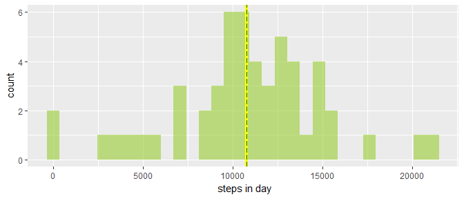
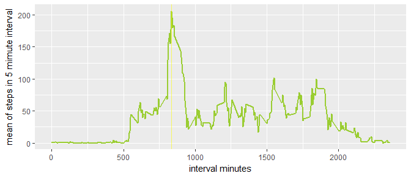
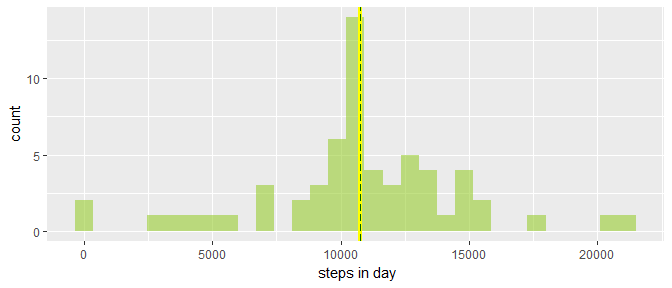
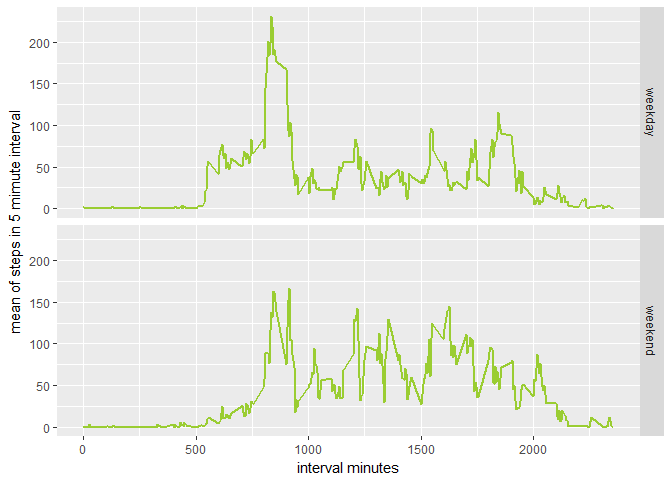

# Reproducible Research: Peer Assessment 1

## Loading and preprocessing the data


```r
library(dplyr)
library(ggplot2)
library(timeDate)
library(xtable)
```

```
## Warning: package 'xtable' was built under R version 3.4.3
```

```r
library(knitr)
data_in<-read.csv("activity.csv",header= TRUE)
data_in$date <- as.Date(data_in$date)
```

## What is mean total number of steps taken per day?

```r
days<-data_in %>% group_by(data_in$date) %>% summarize(day_steps=sum(steps))
days<-days[!is.na(days$day_steps),]

ggplot(data = days, aes(x = day_steps)) +
  geom_histogram(binwidth = (max(days$day_steps)-min(days$day_steps))/30, fill="olivedrab3" ,alpha = 0.6)+
  geom_vline(aes(xintercept = mean(days$day_steps)),col='yellow1',size=1.5)+
  geom_vline(aes(xintercept = median(days$day_steps)), col='darkgreen', size=0.7,linetype= 5)+
  labs(x=" steps in day")
```

<!-- -->

#### Mean and median of steps in day:


```r
aa<-data.frame(c(mean(days$day_steps),median(days$day_steps)),row.names = c("Mean of steps in day:","Median of steps in day:"),fix.empty.names = FALSE)

kable(aa)
```

                                   
------------------------  ---------
Mean of steps in day:      10766.19
Median of steps in day:    10765.00
------------------------  ---------

## What is the average daily activity pattern?

```r
day_steps<-data_in %>% group_by(interval) %>% 
  summarize(int_steps=mean(steps,na.rm = TRUE))
max_ind <- day_steps$interval[which.max(day_steps$int_steps)]
ggplot(data = day_steps ) + 
  geom_line(aes(x = day_steps$interval, y=int_steps), col="olivedrab3", size=1)+
  geom_vline(xintercept = max_ind, col="yellow", size=0.7, alpha=0.6)+
  labs(x="interval minutes", y="mean of steps in 5 mimute interval")
```

<!-- -->

The maximum mean number of steps in 5 minute interval is in interval from 835 minute.

## Imputing missing values


```r
na_s<-sum(is.na(data_in$steps))
```
The total number of missing values: 2304.

Missing values filling strategy:  the mean for missing value 5-minute interval.


```r
data_fill<-data_in
data_fill$steps[is.na(data_fill$steps)]<-apply(data_fill[is.na(data_fill$steps),],1,
                      function(x) day_steps$int_steps[which(day_steps$interval==as.integer(x[3]))])

days_f<-data_fill %>% group_by(data_fill$date) %>% summarize(day_steps=sum(steps))

ggplot(data = days_f, aes(x = day_steps)) +
  geom_histogram(binwidth = (max(days$day_steps)-min(days$day_steps))/30, fill="olivedrab3" ,alpha = 0.6)+
  geom_vline(aes(xintercept = mean(days_f$day_steps)),col='yellow1',size=1.5)+
  geom_vline(aes(xintercept = median(days_f$day_steps)), col='darkgreen', size=0.7,linetype= 5)+
  labs(x=" steps in day")
```

<!-- -->


```r
in_sums<-c(mean(days$day_steps),median(days$day_steps), sum(days$day_steps))
fill_sums<-c(mean(days_f$day_steps),median(days_f$day_steps), sum(days_f$day_steps))
df<-data.frame(cbind(in_sums,fill_sums),row.names = c("Mean of steps in day:", "Median of steps in day:",
                                                      "Total steps:"),fix.empty.names = FALSE)
names(df)<-c( "initial data", "filled data")
kable(df)
```

                           initial data   filled data
------------------------  -------------  ------------
Mean of steps in day:          10766.19      10766.19
Median of steps in day:        10765.00      10766.19
Total steps:                  570608.00     656737.51

## Are there differences in activity patterns between weekdays and weekends?


```r
data_fill$week_part[isWeekend(data_fill$date)]<- "weekend"
data_fill$week_part[!isWeekend(data_fill$date)]<- "weekday"

day_steps_w<-data_fill %>% group_by(week_part, interval) %>% 
  summarize(int_steps=mean(steps,na.rm = TRUE))

ggplot(data = day_steps_w) + 
  geom_line(aes(x = interval, y=int_steps), col="olivedrab3", size=1)+
  facet_grid(as.factor(week_part)~.)+
  labs(x="interval minutes", y="mean of steps in 5 mimute interval")
```

<!-- -->


